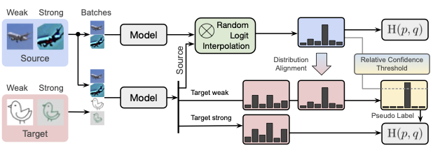

# AdaMatch

Code for the paper: "[AdaMatch: A Unified Approach to Semi-Supervised Learning and Domain Adaptation](https://arxiv.org/abs/2106.04732)" by
David Berthelot, Rebecca Roelofs, Kihyuk Sohn, Nicholas Carlini, and Alex Kurakin.

This is not an officially supported Google product.




## Setup

```bash
sudo apt install python3-dev python3-virtualenv python3-tk imagemagick
virtualenv -p python3 --system-site-packages ~/jax3
. ~/jax3/bin/activate

# Install dependencies (replace with your installed CUDA version)
CUDA_VERSION=11.2
pip install --upgrade -r requirements.txt
pip install -f https://storage.googleapis.com/jax-releases/jax_releases.html jaxlib==`python3 -c 'import jaxlib; print(jaxlib.__version__)'`+cuda`echo $CUDA_VERSION | sed s:\\\.::g`
```

### Required environment variables

```bash
export ML_DATA="path to where you want the datasets saved"
export PYTHONPATH=$PYTHONPATH:.
```

### Potentially useful environment variables

```bash
# Use this config if you won't want JAX to take the whole GPU memory
export XLA_PYTHON_CLIENT_PREALLOCATE=false
```


## Data preparation

```bash
# Download datasets and save them as TF records
CUDA_VISIBLE_DEVICES= python scripts/create_datasets.py

# Alternatively if your machine has many cores, this parallel version is much faster to run.
bash ./runs/create_datasets.sh
```

## Training

### Options

- `--logdir` where the results are saved.
- `--uratio` ratio of unlabeled data / label data.
- `--augment` typically can take two values (weak,strong) augmentation and a prefix (Control-Theory Augment (CTA)
  introduced in ReMixMatch or no prefix). Examples:
  - `--augment=\(sm,smc\)` weak augmentation is shift and mirror, strong augmentation is shift, mirror and cutout.
  - `--augment=CTA\(sm,sm\)` weak augmentation is shift and mirror, strong augmentation CTA on top of shift and mirror.

#### Specific to Domain Adaptation (DA) and Semi-Supervised Domain Adaptation (SSDA)
- `--dataset` dataset to use with desired size, example: `domainnet32` (32x32 images)
- `--source` source subset (for example `clipart`)
- `--target` target subset to which to adapt the source (for example `quickdraw`)

**Note**: for **SSDA**, the target takes a different form.
- `--target` target subset to which to adapt the source and how many label per class to use and what random seed to use
  (for example `quickdraw(3,seed=2)` means use 3 labels per class picked at random using random seed 2)


#### Specific to Semi-Supervised Learning (SSL)
- `--dataset` combines both dataset and source from SSDA in a single option. For example:
  `domainnet32_quickdraw(3,seed=2)`.

### Fully supervised

```bash
# Baseline: source and target must be the same. Additionally, one can specify extra test sets.
python fully_supervised/baseline.py --dataset=domainnet32 --source=clipart --target=clipart\
    --logdir experiments/2021/02.12-32 --augment=CTA\(sm,sm\)\
    --test_extra=clipart,infograph,quickdraw,real,sketch,painting
```

### Domain adaptation

```bash
# Baseline: does nothing for unlabeled except running it with labeled as a single batch through the network.
python domain_adaptation/baseline.py --dataset=domainnet32 --source=clipart --target=quickdraw\
    --logdir experiments/2021/02.12-32 --uratio=3 --augment=CTA\(sm,sm\)
python domain_adaptation/baseline.py --dataset=domainnet32 --source=clipart --target=quickdraw\
    --logdir experiments/2021/02.12-32 --uratio=1 --augment=\(sm,smc\)

# FixMatch
python domain_adaptation/fixmatch_da.py --dataset=domainnet32 --source=clipart --target=quickdraw\
    --logdir experiments/2021/02.12-32 --uratio=3 --augment=CTA\(sm,sm\)
python domain_adaptation/fixmatch_da.py --dataset=domainnet32 --source=clipart --target=quickdraw\
    --logdir experiments/2021/02.12-32 --uratio=1 --augment=\(sm,smc\)

# AdaMatch
python domain_adaptation/adamatch.py --dataset=domainnet32 --source=clipart --target=quickdraw\
    --logdir experiments/2021/02.12-32 --uratio=3 --augment=CTA\(sm,sm\)
python domain_adaptation/adamatch.py --dataset=domainnet32 --source=clipart --target=quickdraw\
    --logdir experiments/2021/02.12-32 --uratio=1 --augment=\(sm,smc\)

# NoisyStudent
## Teacher
python domain_adaptation/noisy_student.py --dataset=domainnet32 --source=clipart --target=quickdraw\
    --logdir experiments/2021/02.12-32 --pseudo_label_th=0.9 --augment=CTA\(sm,sm\)\
    --id=0
## Student
python domain_adaptation/noisy_student.py --dataset=domainnet32 --source=clipart --target=quickdraw\
    --logdir experiments/2021/02.12-32 --pseudo_label_th=0.9 --augment=CTA\(sm,sm\) --id=1\
    --pseudo_label_file=experiments/2021/03.1-32/DA/domainnet32/clipart/quickdraw/CTA\(sm,sm\)/NoisyStudent/archwrn28-2_batch64_lr0.03_lr_decay0.25_wd0.001/0/predictions.npy

# MCD
python domain_adaptation/mcd.py --dataset=domainnet64 --source=clipart --target=quickdraw\
    --uratio=1 --arch=wrn28-2 --augment='CTA(sm,sm)' --train_mimg=8 --logdir experiments/2021/02.12-32 --lr_decay 0.25
```

#### Multi-source domain adaptation

Use `no` in front of the subdomain to use all domains but the one concerned.

```bash
python domain_adaptation/adamatch.py --dataset=domainnet32 --source=no_quickdraw --target=quickdraw\
    --logdir experiments/2021/02.12-32 --uratio=3 --augment=CTA\(sm,sm\)
````

### Semi-Supervised Domain adaptation

```bash
# FixMatch
python semi_supervised_domain_adaptation/fixmatch_da.py --dataset=domainnet32 --source=clipart\
    --target=quickdraw\(10,seed=1\)\
    --logdir experiments/2021/02.12-32 --uratio=3 --augment=CTA\(sm,sm\)

# AdaMatch
python semi_supervised_domain_adaptation/adamatch.py --dataset=domainnet32 --source=clipart\
    --target=quickdraw\(10,seed=1\)\
    --logdir experiments/2021/02.12-32 --uratio=3 --augment=CTA\(sm,sm\)
```

### Semi-Supervised Learning

```bash
# FixMatch
python semi_supervised/fixmatch_da.py --dataset=domainnet32_quickdraw\(10,seed=1\)\
    --logdir experiments/2021/02.12-32 --uratio=3 --augment=CTA\(sm,sm\)

# AdaMatch
python semi_supervised/adamatch.py --dataset=domainnet32_quickdraw\(10,seed=1\)\
    --logdir experiments/2021/02.12-32 --uratio=3 --augment=CTA\(sm,sm\)
```

## Tensorboard

```bash
tensorboard --logdir experiments
```
